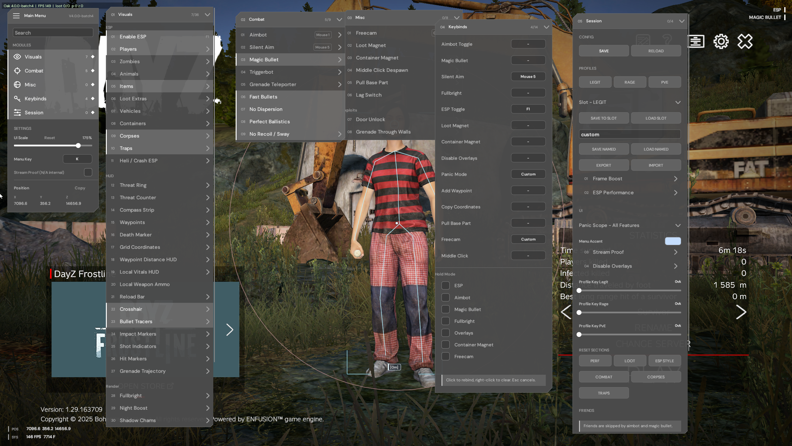
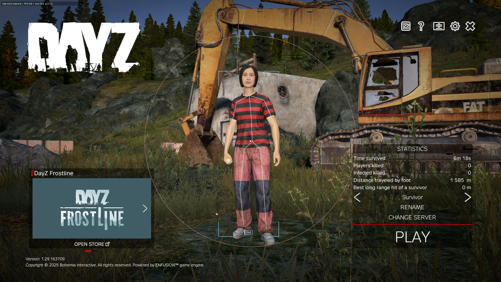

# Oak DayZ Internal v2

Public source release of the Oak DayZ internal client stack.

## Screenshots





## Layout

- `oak/apps/web` — website (Next.js)
- `oak/apps/api` — API + admin (Express + SQLite)
- `oak/apps/launcher` — launcher / injector / kernel handoff
- `oak/packages/protect` — OakProtect build-time protection tooling
- `oak/clients/dayz` — DayZ client DLL, kernel driver, injector, injection scripts, and auto Steam launch scripts

## Getting started

1. Copy `oak/apps/api/.env.example` to `oak/apps/api/.env` and set fresh secrets before any real use.
2. See [`oak/README.md`](./oak/README.md) for build instructions and [`oak/AGENTS.md`](./oak/AGENTS.md) for repository conventions.
3. Build with `oak\scripts\build_all.ps1` (needs Visual Studio C++ + WDK, CMake, .NET 8, Node.js).

## Notes

- Local configs, databases, build outputs, and secrets are gitignored — only source ships here.
- Before publishing any client DLL, run the security gate:

```powershell
node oak/packages/protect/tools/ship_security_gate.mjs --dll <path\to\client.dll> --mutate
```
